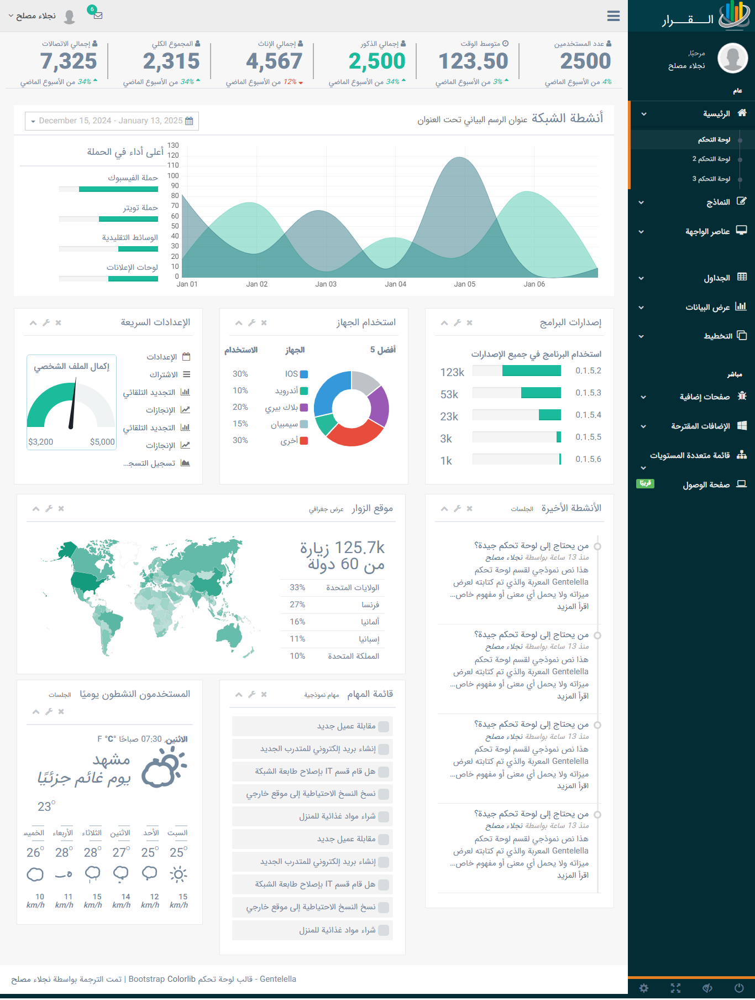

<div dir="RTL" align="right" style="direction:rtl;text-align:right;">

# Gentelella RTL / قالب إدارة مخصص للغة العربية

Gentelella هو قالب إدارة مخصص للغة العربية تم تطويره بناءً على القالب الأصلي الذي يمكنك مشاهدته على الرابط [Gentelella](https://github.com/puikinsh/gentelella).

## عرض توضيحي للقالب



## تغيير الخط

يمكنك اختيار الخط من بين 4 خيارات متاحة عن طريق إضافة أحد الفئات التالية إلى وسم `body`.

<div dir="LTR" align="left" style="direction:ltr;text-align:left;">

**IRanSans (الخط الافتراضي)**
body.iransans
**IRanSans مع الأرقام الفارسية**
```
body.iransans
```


**IRanSans مع الأرقام الفارسية**


```
body.iransans.persian_num
```


**خط Vazir**


```
body.vazir
```


**خط Yekan**


```
body.yekan
```

</div>

</div>

## التثبيت باستخدام مدير الحزم

هدفي هو جعل هذه الحزمة قابلة للتثبيت باستخدام جميع مديري الحزم المختلفة. إذا لم يكن مدير الحزم الذي تريده مدرجًا أدناه، يمكنك ببساطة تقديم طلب Pull Request.

فيما يلي بعض طرق تثبيت هذه الحزمة:


**التثبيت باستخدام GitHub**

<div dir="LTR" align="left" style="direction:ltr;text-align:left;">
git clone https://github.com/naglaamossleh2016/rtl-dashs.git


</div>

## كيفية المساهمة
للمساهمة، تأكد من تثبيت أحدث إصدار مستقر من [Node.js](https://nodejs.org/) و [npm](https://npmjs.com).

تحقق من تثبيت Gulp CLI باستخدام `gulp --version`. إذا لم يكن مثبتًا، يمكنك تثبيته باستخدام الأمر `npm install -g gulp`. لمزيد من المعلومات حول تثبيت Gulp، يمكنك زيارة [بدء العمل](https://github.com/gulpjs/gulp/blob/master/docs/getting-started.md).

إذا كان `gulp` مثبتًا، قم بتنفيذ الخطوات التالية.

1. استنساخ ونسخ هذا المستودع.
2. تشغيل `gulp`، مما يؤدي إلى فتح Gentelella في المتصفح الافتراضي لديك.
3. والآن يمكنك البدء في البرمجة والبرمجة والبرمجة...!
4. تقديم طلب Pull Request

## البرامج النصية المستخدمة:
<div dir="LTR" align="left" style="direction:ltr;text-align:left;">

* Bootstrap
* Bootstrap-rtl
* Font Awesome
* jQuery-Autocomplete
* FullCalendar
* Charts.js
* Bootstrap Colorpicker
* Cropper
* dataTables
* Date Range Picker for Bootstrap
* Dropzone
* easyPieChart
* ECharts
* bootstrap-wysiwyg
* Flot - مكتبة الرسوم البيانية لجافا سكريبت لجيكويري.
* gauge.js
* iCheck
* jquery.inputmask plugin
* Ion.RangeSlider
* jQuery
* jVectorMap
* moment.js
* Morris.js - رسوم بيانية جميلة للسلاسل الزمنية
* PNotify - إشعارات جافا سكريبت رائعة
* NProgress
* Pace
* Parsley
* bootstrap-progressbar
* select2
* Sidebar Transitions - تنقلات بسيطة خارج الشاشة
* Skycons - أيقونات الطقس المعتمدة على Canvas
* jQuery Sparklines plugin
* switchery - يحول مدخلات HTML checkbox إلى مفاتيح تبديل على غرار iOS
* jQuery Tags Input Plugin
* Autosize - تغيير حجم منطقة النص ليتناسب مع النص
* validator - مدقق HTML باستخدام jQuery
* jQuery Smart Wizard
* moment-jalaali

</div>


<div dir="LTR" align="left" style="direction:ltr;text-align:left;">

## معلومات الترخيص


Gentelella RTL مرخص تحت رخصة MIT. مما يعني أنه يمكنك استخدام، نسخ، تعديل، دمج، نشر، توزيع، ترخيص فرعي، و/أو بيع نسخ من البرنامج. ولكن يجب دائمًا ذكر أن Colorlib هو المؤلف الأصلي لهذا القالب.

تم تطوير المشروع وصيانته بواسطة [Naglaa Mossleh]
</div>
</div>
